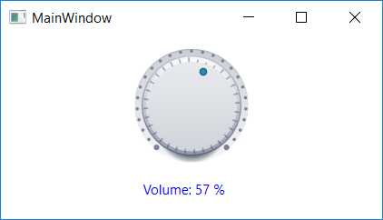

<!-- default badges list -->

<!-- default badges end -->

# WPF Gauges - Create a Knob-like Gauge

This example customizes the [CircularGaugeControl](https://docs.devexpress.com/WPF/DevExpress.Xpf.Gauges.CircularGaugeControl). As a result, the control looks and behaves like a 'knob' element of a real-life dashboard.

## Implementation Details

The **KnobResourceDictionary.xaml** file contains the following custom templates:

* The **OscilloscopeNeedleTemplate** changes the arc scale's [needle](https://docs.devexpress.com/WPF/9957/controls-and-libraries/gauge-controls/visual-elements/circular-gauge/needle) appearance.
* The **OscilloscopeScaleLayerTemplate** changes the arc scale's [layer](https://docs.devexpress.com/WPF/9962/controls-and-libraries/gauge-controls/visual-elements/circular-gauge/layers) appearance.

Set the needle's [IsInteractive](https://docs.devexpress.com/WPF/DevExpress.Xpf.Gauges.ValueIndicatorBase.IsInteractive) property to `true` to allow users to change the gauge's value. The gauge stores its value in the needle's `Value` property.

## Files to Review

* [KnobResourceDictionary.xaml](./CS/DXGauges_Knobs/KnobResourceDictionary.xaml) (VB: [KnobResourceDictionary.xaml](./VB/DXGauges_Knobs/KnobResourceDictionary.xaml))
* [MainWindow.xaml](./CS/DXGauges_Knobs/MainWindow.xaml) (VB: [MainWindow.xaml](./VB/DXGauges_Knobs/MainWindow.xaml))

## Documentation

* [CircularGaugeControl](https://docs.devexpress.com/WPF/DevExpress.Xpf.Gauges.CircularGaugeControl)
* [Circular Gauge Elements](https://docs.devexpress.com/WPF/9954/controls-and-libraries/gauge-controls/visual-elements/circular-gauge)
<!-- feedback -->
## Does this example address your development requirements/objectives?

 

(you will be redirected to DevExpress.com to submit your response)
<!-- feedback end -->
