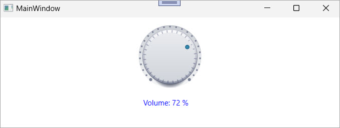

<!-- default badges list -->

[](https://supportcenter.devexpress.com/ticket/details/E3335)
[](https://docs.devexpress.com/GeneralInformation/403183)
[](#does-this-example-address-your-development-requirementsobjectives)
<!-- default badges end -->

# WPF Gauges – Create a Volume Knob

This example changes the [`CircularGaugeControl`](https://docs.devexpress.com/WPF/DevExpress.Xpf.Gauges.CircularGaugeControl) so that it looks and behaves like a volume knob. Turn the gauge needle to update the percentage label under the control.



Use the `CircularGaugeControl` when you need to:

* Create an interactive rotary control to adjust a value.
* Imitate analog controls in dashboards, audio mixers, or monitoring panels.
* Apply a custom design to match a specific UI theme.

## Implementation Details

### Custom Needle and Scale Templates

Define custom templates in the [KnobResourceDictionary.xaml](./CS/DXGauges_Knobs/KnobResourceDictionary.xaml) file:

* `OscilloscopeNeedleTemplate` – changes the needle shape and color.
* `OscilloscopeScaleLayerTemplate` – changes the gauge background and decorative elements.

The following code example applies templates through [`CustomArcScaleNeedlePresentation`](https://docs.devexpress.com/WPF/DevExpress.Xpf.Gauges.CustomArcScaleNeedlePresentation) and [`CustomArcScaleLayerPresentation`](https://docs.devexpress.com/WPF/DevExpress.Xpf.Gauges.CustomArcScaleLayerPresentation) properties:

```xaml
<dxga:ArcScaleNeedle.Presentation>
    <dxga:CustomArcScaleNeedlePresentation
        NeedleTemplate="{StaticResource OscilloscopeNeedleTemplate}" />
</dxga:ArcScaleNeedle.Presentation>
...
<dxga:ArcScaleLayer.Presentation>
    <dxga:CustomArcScaleLayerPresentation
        ScaleLayerTemplate="{StaticResource OscilloscopeScaleLayerTemplate}" />
</dxga:ArcScaleLayer.Presentation>
```

### Gauge Configuration

The circular gauge has the following features:

* Starts at `0` and ends at `100`.
* Uses a custom start/end angle to simulate knob rotation.
* Hides numeric labels and displays only tick marks.
* Supports interactive needle movement.

```xaml
<dxga:ArcScale
    StartValue="0" EndValue="100"
    StartAngle="-230" EndAngle="50"
    ShowLabels="False">
```

Use the `SmartTickmarksPresentation` property to change the tick mark style and position tick marks with negative offsets to align with the custom scale.

### Value Display

A `Label` displays the gauge value. Its content is bound to the needle’s `Value` property:

```xaml
<Label Content="{Binding ElementName=needle, Path=Value}"
       ContentStringFormat=" Volume: {0:f0} % " />
```

The label updates automatically when the knob is rotated.

## Files to Review

* [KnobResourceDictionary.xaml](./CS/DXGauges_Knobs/KnobResourceDictionary.xaml) (VB: [KnobResourceDictionary.xaml](./VB/DXGauges_Knobs/KnobResourceDictionary.xaml))
* [MainWindow.xaml](./CS/DXGauges_Knobs/MainWindow.xaml) (VB: [MainWindow.xaml](./VB/DXGauges_Knobs/MainWindow.xaml))

## Documentation

* [CircularGaugeControl](https://docs.devexpress.com/WPF/DevExpress.Xpf.Gauges.CircularGaugeControl)
* [Circular Gauge Elements](https://docs.devexpress.com/WPF/9954/controls-and-libraries/gauge-controls/visual-elements/circular-gauge)
* [CustomArcScaleLayerPresentation](https://docs.devexpress.com/WPF/DevExpress.Xpf.Gauges.CustomArcScaleLayerPresentation)
* [CustomArcScaleNeedlePresentation](https://docs.devexpress.com/WPF/DevExpress.Xpf.Gauges.CustomArcScaleNeedlePresentation)
* [Gauge Controls](https://docs.devexpress.com/WPF/115093/controls-and-libraries/gauge-controls)

## More Examples

* [WPF Linear Gauge – Display Custom UI Elements](https://github.com/DevExpress-Examples/wpf-linear-gauge-display-custom-ui-elements)
* [WPF Gauges Getting Started – Lesson 3 – Create a Digital Gauge](https://github.com/DevExpress-Examples/wpf-gauges-getting-started-create-digital-gauge)
* [WPF Gauges – Set Width and Height of Symbols in Digital Gauge](https://github.com/DevExpress-Examples/wpf-gauges-set-width-and-height-of-symbols-in-digital-gauge-control)
* [WPF Gauge – Create a Digital Gauge](https://github.com/DevExpress-Examples/wpf-create-digital-gauge)
* [Reporting for WPF – Advanced Gauge Customization](https://github.com/DevExpress-Examples/reporting-wpf-advanced-gauge-customization)

<!-- feedback -->
## Does this example address your development requirements/objectives?

[](https://www.devexpress.com/support/examples/survey.xml?utm_source=github&utm_campaign=wpf-gauges-create-volume-knob&~~~was_helpful=yes) [](https://www.devexpress.com/support/examples/survey.xml?utm_source=github&utm_campaign=wpf-gauges-create-volume-knob&~~~was_helpful=no)

(you will be redirected to DevExpress.com to submit your response)
<!-- feedback end -->
